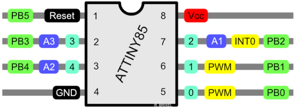

# ASTRAMO
The AirSoft TRAcer MOdule!

## Features
Easy to build Airsoft-/Softair-Tracer to fit e.g. in a silencer.
- independent battery pack
- cheap
- can light up green AND red BBs

## Idea storage
Because the project is not finished yet, I save some info here :)

### ATTiny85 Pinout

### IR 38 kHz
- Arduino Lib: https://www.arduino.cc/reference/en/libraries/irremote/
- TSOP 4838 IR-receiver-module, 38kHz, 90°, Side-View (Reichelt: TSOP 4838)
- IR-LED with a wavelenght of 940nm

### Simple IR photoelectric barrier
- IR-LED (Reichelt: LD 274-3)
- Receiver photdiode (Reichelt: SFH 203)

### ATTiny85
- Small, cheap, simple and enough pins
- runs on 3,3V to save energy

### Voltage monitoring
- protects battery from deep discharge
- measure over simple voltage divider

### Battery
- Using a standard Li-Po 2S (7,4V)